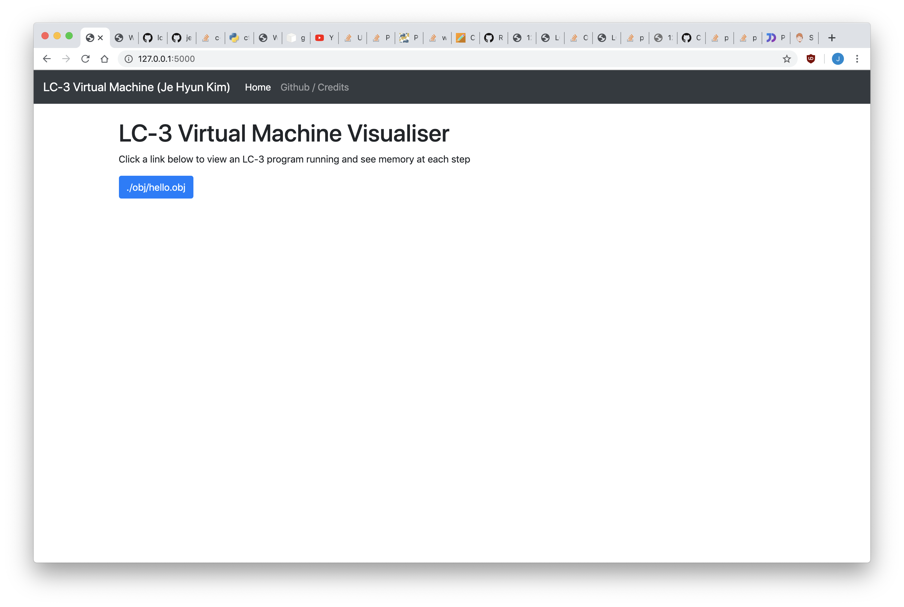
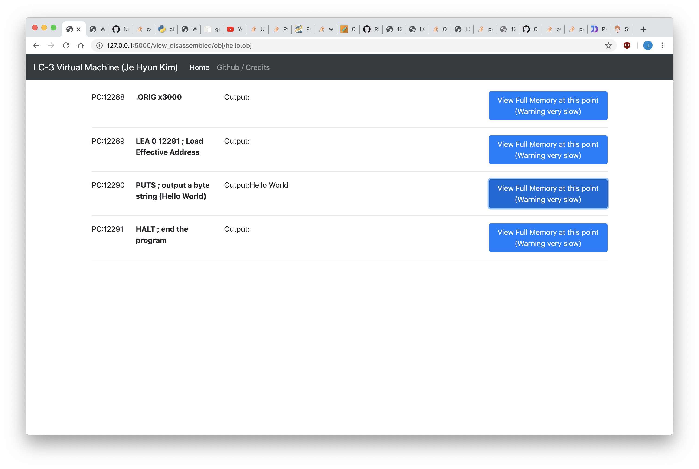
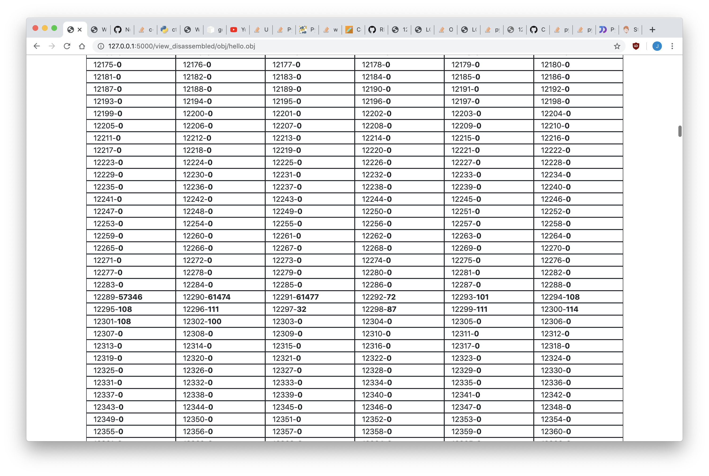

# mini_virtual_machine
A small lc3 virtual machine for education purposes.



## Pre-requisites
This project uses python3.

Install requirements:
```pip install -r requirements.txt```

## Run Instructions

```shell
git clone https://github.com/je-hyun/mini_virtual_machine.git
cd mini_virtual_machine
```

Once your virtual environment is activated, set up using these commands:
```shell
export FLASK_APP=app.py
pip install -r requirements.txt
```

And finally, to run:
```shell
flask run
```

Optionally, you could execute the following for developer mode:
```shell
export FLASK_ENV=development
```

## Contributors
* Je Hyun Kim

## Special Thanks
* Special thanks to Justin Meiners and Ryan Pendleton, for their blog post on how to create a virtual machine. Visit https://justinmeiners.github.io/lc3-vm/ to create your own.
* Code is adapted from https://github.com/paul-nameless/lc3-vm/tree/88bdc83d3868891521cbfa4e0c9ff5a12a520edb
## License
MIT License
